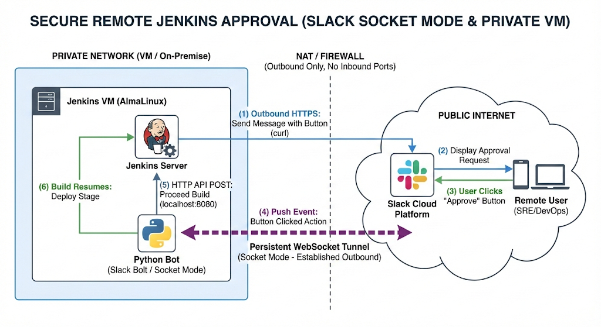

# remote build by slack

# 흐름도



- Jenkins 서버는 NAT를통한 인터넷 접근은 되나, 외부에서는 접근 불가능
- Jenkins 서버에 Slack bot을 생성하여 인터넷과 Websocket 터널링 연결
- Jenkins build → Slack 알람 → 승인 → Slack bot이 젠킨스 Job 이어서 실행

# 준비 사항

## 젠킨스 서버에 Pytohn3 및 라이브러리 설치

```bash
# 워크 디렉토리 생성
mkdir remote-build; cd remote-build

# pytohn 설치 및 가상환경 실행
sudo dnf install python3
python3 -m venv slack-bot-env
source slack-bot-env/bin/activate

# 라이브러리 설치
pip install --upgrade pip
pip install slack_bolt requests
pip install python-dotenv
```

## Slack 설정

[https://docs.slack.dev/apis/events-api/using-socket-mode](https://docs.slack.dev/apis/events-api/using-socket-mode/)/  << 참고

Slack에서는 총 2가지의  토큰을 메모하면 됩니다.

1. Web socket을 위한 API KEY ( xapp- 으로 시작 )
2. Slack bot을 위한 Bot OAuth key ( xox- 로 시작 )

### Step 1: Slack App 만들기 (Socket Mode 켜기)

1. [Slack API 페이지](https://api.slack.com/apps) 접속 -> **Create New App** -> **From scratch**.
    
    
    
2. **Socket Mode** 메뉴 클릭 -> **Enable Socket Mode** 활성화.
    - 이때 `App-Level Token`을 생성하라고 나옵니다.  `connections:write` 권한을 주고 생성합니다.
    - **토큰 복사 (`xapp-` 로 시작)** -> 메모해두세요.
        
        
        
3. **Event Subscriptions** 메뉴 클릭 -> **Enable Events** 활성화. (URL 검증 과정이 생략됩니다.)
    
    
    
4. **OAuth & Permissions** 메뉴 클릭 -> **Scopes** (Bot Token Scopes)에 다음 권한 추가:
    - `chat:write` (메세지 쓰기)
    - `im:history` (DM 읽기)
        
        
        
5. **Install App to Workspace** 클릭 -> 허용.
    - **Bot User OAuth Token 복사 (`xoxb-` 로 시작)** -> 메모해두세요.

# 젠킨스에 Bot OAuth 토큰 넣어주기 ( xox- 로 시작 )


---

## 젠킨스 서버에 봇 활성화

( 가상환경 activate 상태에서 )

## Token 정보를 위한 .env 파일 생성

총 필요한 인자는 4개입니다. 

Slack 관련 : websocket 토큰, bot 0Auth 토큰, Slack 채널 ID

Jenkins 관련 : Jenkins configuration 토큰 

```bash
( 파이썬 가상환경 activate 상태에서 )
cp env.tmp .env
```

## .env

```bash
# Slack Tokens ( 아까 메모해놓은 토큰들 넣으세요요 )
SLACK_BOT_TOKEN=
SLACK_APP_TOKEN=

# Jenkins Configuration ( 서버 환경에 맞춰 변경 )
JENKINS_URL=http://localhost:8080
JENKINS_USER=admin
JENKINS_TOKEN=

# Optional: Slack Channel ID
SLACK_CHANNEL_ID=
```

## bot.py

```bash
import os
import requests
from dotenv import load_dotenv
from slack_bolt import App
from slack_bolt.adapter.socket_mode import SocketModeHandler
from requests.auth import HTTPBasicAuth

# 1. .env 파일로부터 환경변수 로드
load_dotenv()

# 2. 환경변수 할당 (없을 경우 에러 발생시켜 실행 방지)
SLACK_BOT_TOKEN = os.environ.get("SLACK_BOT_TOKEN")
SLACK_APP_TOKEN = os.environ.get("SLACK_APP_TOKEN")
JENKINS_URL = os.environ.get("JENKINS_URL")
JENKINS_USER = os.environ.get("JENKINS_USER")
JENKINS_TOKEN = os.environ.get("JENKINS_TOKEN")

if not all([SLACK_BOT_TOKEN, SLACK_APP_TOKEN]):
    raise ValueError("필수 슬랙 토큰이 설정되지 않았습니다. .env 파일을 확인하세요.")

app = App(token=SLACK_BOT_TOKEN)

@app.action("approve_build")
def handle_approval(ack, body, client):
    ack()

    # 버튼 value에 담긴 "job_name/build_number" 추출
    metadata = body['actions'][0]['value']
    job_name, build_number = metadata.split("/")
    user_id = body['user']['id']

    print(f"[*] 승인 요청 감지: {job_name} #{build_number} by <@{user_id}>")

    # 젠킨스 Input 승인 API 호출
    # Input ID인 'AskApproval'은 Jenkinsfile 설정과 일치해야 함
    api_url = f"{JENKINS_URL}/job/{job_name}/{build_number}/input/AskApproval/proceedEmpty"

    try:
        response = requests.post(
            api_url,
            auth=HTTPBasicAuth(JENKINS_USER, JENKINS_TOKEN),
            timeout=10
        )

        if response.status_code in [200, 302]:
            # 기존 메세지 업데이트하여 버튼 제거 및 승인자 표시
            client.chat_update(
                channel=body['channel']['id'],
                ts=body['message']['ts'],
                text=f":white_check_mark: <@{user_id}> 님이 {job_name} #{build_number} 빌드를 승인했습니다.",
                blocks=[]
            )
        else:
            print(f"[!] 젠킨스 응답 에러: {response.status_code}")

    except Exception as e:
        print(f"[!] 통신 에러: {e}")

if __name__ == "__main__":
    print("⚡️ Slack Bot is booting up with Socket Mode...")
    handler = SocketModeHandler(app, SLACK_APP_TOKEN)

```

```bash
(slack-bot-env) [user1@cicd remote-build]$ pwd
/home/user1/remote-build
(slack-bot-env) [user1@cicd remote-build]$ ls -al
total 12
drwxr-xr-x. 3 user1 user1   79 Feb 15 00:12 .
drwx------. 5 user1 user1  165 Feb 15 00:12 ..
-rw-r--r--. 1 user1 user1  392 Feb 14 15:32 .env
-rw-r--r--. 1 user1 user1 2245 Feb 14 13:57 bot.py
-rw-r--r--. 1 user1 user1  130 Feb 14 12:10 remote-build-token
drwxr-xr-x. 5 user1 user1   74 Feb 14 23:56 slack-bot-env

```

```bash
# .env와 bot.py 가 있는 디렉토리에서 bot.py 실행
python3 bot.py
```


---

# Jenkins 대시보드에서 해야할 일

별 다른 설정 필요없이 pipeline 내용 넣으시면 됩니다.


## Jenkinsfile 내용 ( 상단의 슬랙 채널 ID 만 변경하면 됩니다 )

```bash
pipeline {
    agent any

    environment {
        // 젠킨스 Credentials에 등록한 ID와 일치해야 함
        SLACK_CREDENTIAL_ID = 'slack-bot-token'
        // 슬랙 채널 ID (C로 시작하는 값)
        CHANNEL_ID = 'C0AF0K6NTJN' 
    }

    stages {
        stage('Ask for Approval') {
            steps {
                script {
                    // 1. 슬랙에 보낼 JSON Payload 구성 (env 객체 활용)
                    // 이 블록은 젠킨스 보안 승인 요구를 최소화합니다.
                    def payloadJson = """
                    {
                        "channel": "${env.CHANNEL_ID}",
                        "blocks": [
                            {
                                "type": "section",
                                "text": {
                                    "type": "mrkdwn",
                                    "text": "* 배포 승인 요청*\\n*Job:* ${env.JOB_NAME}\\n*Build:* #${env.BUILD_NUMBER}\\n\\n외부에서 승인 버튼을 누르면 배포가 재개됩니다."
                                }
                            },
                            {
                                "type": "actions",
                                "elements": [
                                    {
                                        "type": "button",
                                        "text": { "type": "plain_text", "text": "승인 (Approve)" },
                                        "style": "primary",
                                        "value": "${env.JOB_NAME}/${env.BUILD_NUMBER}",
                                        "action_id": "approve_build"
                                    }
                                ]
                            }
                        ]
                    }
                    """

                    // 2. 환경변수에 페이로드 저장 (sh에서 접근 가능하도록)
                    env.SLACK_PAYLOAD = payloadJson

                    // 3. 슬랙 메시지 전송 (withCredentials 사용)
                    withCredentials([string(credentialsId: env.SLACK_CREDENTIAL_ID, variable: 'BOT_TOKEN')]) {
                        // 작은 따옴표(')를 사용하여 Groovy Interpolation 대신 Shell Variable 사용
                        sh '''
                            curl -X POST \
                            -H "Authorization: Bearer $BOT_TOKEN" \
                            -H "Content-type: application/json; charset=utf-8" \
                            --data "$SLACK_PAYLOAD" \
                            https://slack.com/api/chat.postMessage
                        '''
                    }

                    // 4. 젠킨스 빌드 일시 중단 및 대기
                    // id는 Python 봇의 API 호출 경로와 일치해야 함 (case-sensitive)
                    input id: 'AskApproval', message: '슬랙에서 승인을 기다리는 중입니다...'
                }
            }
        }

        stage('Deploy') {
            steps {
                echo "--------------------------------------------------"
                echo "✅ 승인이 완료되었습니다. 배포 단계를 실행합니다."
                echo "--------------------------------------------------"
                // 여기에 실제 배포 스크립트 작성 (예: ansible, kubectl 등)
            }
        }
    }

    post {
        failure {
            echo "❌ 빌드 또는 승인 과정에서 오류가 발생했습니다."
        }
        aborted {
            echo "🛑 사용자에 의해 빌드가 중단되었습니다."
        }
    }
}
```

---

# 테스트 결과

젠킨스에서 빌드 시작하시면 Slack으로 알람이 옵니다.


승인 버튼 누르면 input 받아서 대기중이던 빌드를 다시 개시함

( 동일한 와이파이가 아닌 데이터를 사용한 모바일 에서도 테스트 완료 )

---

# 트러블 슈팅  + 비고

```
Started by user admin
org.jenkinsci.plugins.scriptsecurity.scripts.UnapprovedUsageException: script not yet approved for use
	at PluginClassLoader for script-security//org.jenkinsci.plugins.scriptsecurity.scripts.ScriptApproval.using(ScriptApproval.java:695)
	at PluginClassLoader for workflow-cps//org.jenkinsci.plugins.workflow.cps.CpsFlowDefinition.create(CpsFlowDefinition.java:137)
	at PluginClassLoader for workflow-cps//org.jenkinsci.plugins.workflow.cps.CpsFlowDefinition.create(CpsFlowDefinition.java:70)
	at PluginClassLoader for workflow-job//org.jenkinsci.plugins.workflow.job.WorkflowRun.run(WorkflowRun.java:317)
	at hudson.model.ResourceController.execute(ResourceController.java:97)
	at hudson.model.Executor.run(Executor.java:456)
Finished: FAILURE
```

젠킨스 빌드 결과가 다음과같이 나온다면


in-process script approvals 에서 승인해주면 다음 빌드부터 신뢰함.